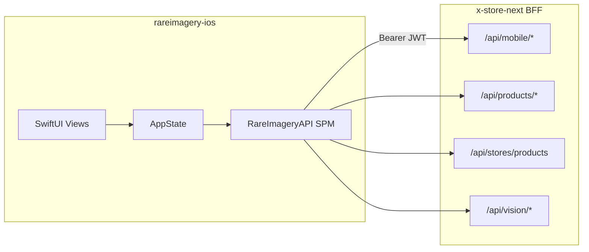
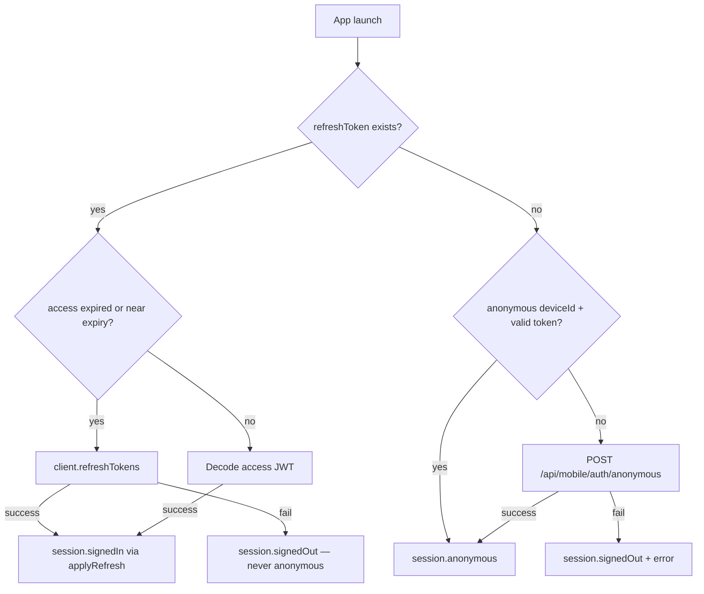
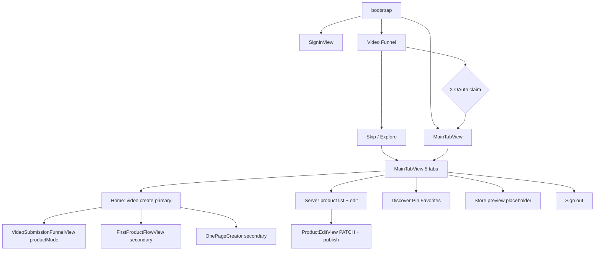

# RareImagery iOS — Code Review

**Review date:** 2026-07-06 (updated)  
**Previous review:** 2026-07-05  
**Branch:** `feat/value-first-flow-reconcile` (tip `9002600`)  
**Repository:** `rareimagery-ios`  
**Reviewer scope:** Static codebase review (no live BFF/Drupal verification)  
**Codebase state:** `useMocks = false` in [`AppState.swift`](../RareImagery/State/AppState.swift); live BFF integration assumed for funnel, auth, and products.

---

## Changelog Since July 5 Review

| Commit | Change |
|--------|--------|
| `2790544` | Auth hardening: proactive refresh, bootstrap refresh, `AuthEventHandlers`, session invalidation |
| `8699b3d` | OAuth presentation anchor fix, `X_CLIENT_ID` placeholder guard, dedup callback handler, DEBUG skip sign-in |
| `16a335c` | Brand fonts bundled (Space Grotesk, Hanken Grotesk, JetBrains Mono); violet/gold theme tokens |
| `1243142` | Foreground retry for anonymous bootstrap when BFF was briefly down |
| `4fcc820` | JWT camelCase decode fix (`storeUuid`); legacy wizard uses configured base URL |
| `9490300` | Funnel tolerant category/condition decode; surfaces real valuation errors |
| `4785eb2` | **Routing:** signed-in users go straight to `MainTabView` — `LivePreviewView` interstitial removed |
| `7b8c734` | Home **Create** routes to video funnel, not merch generator |
| `1095caf` / `c1caadb` | `CameraPicker` added; auto-open camera removed (sheet deadlock) |
| `c1caadb` | Signed-in product creation reuses video+Grok funnel (`productMode: true`) |
| `4d690a9` | Claimed funnel video surfaces as editable first product |
| `04ca98d` | **Creations → Products** tab; server-backed list via `GET /api/stores/products` |
| `9002600` | `ProductEditView` — tap product to edit title/description/price + publish |

---

## Executive Summary

### Verdict

The RareImagery iOS app is a **production-oriented thin client** that has moved well past its README's "Phase A in progress" description. Since the July 5 review, the team closed all four P0 auth blockers, shipped a server-backed Products tab with edit/publish, and simplified post-sign-in routing so creators land directly on Home.

The primary create path is now **video → Grok valuation → product draft** (anonymous claim via X OAuth, or signed-in via `productMode`). Photo capture and OnePageCreator remain as secondary entry points from Home.

The app is **closer to TestFlight-ready** than the prior review indicated, but still needs README sync, a few stub surfaces (QuickProduct, TweakSheet slug check), and one failing JWT unit test before calling auth "done."

### Readiness Snapshot

| Area | Jul 5 | Current (Jul 6) | Notes |
|------|-------|-----------------|-------|
| X OAuth sign-in | Implemented | **Implemented + hardened** | PKCE, presentation anchor, placeholder guard, DEBUG skip |
| Auth session hardening | Partial | **Implemented** | Proactive refresh, bootstrap refresh, global sign-out |
| Anonymous trial funnel | Implemented | **Implemented** | Live API; foreground bootstrap retry |
| Post-sign-in onboarding | LivePreview → tabs | **Removed** | Signed-in → `MainTabView` directly |
| Primary create (signed-in) | OnePageCreator | **Video funnel** | Home Create → `VideoSubmissionFunnelView(productMode: true)` |
| OnePageCreator (merch) | Implemented | **Secondary path** | Home → "Design merch instead" |
| Products tab | Local draft only | **Implemented** | `listMine()` + `ProductEditView` edit/publish |
| Photo capture pipeline | Orphaned | **Secondary path** | Home → "Use photos instead" → `FirstProductFlowView` |
| Circle social | Implemented | Implemented | Phase 1 complete per [PHASE_1_COMPLETE.md](PHASE_1_COMPLETE.md) |
| QuickProduct sell form | Stub | **Still stub** | UI complete; `ProductRepository.create` not wired |
| Page editor tab | Stub | **Partial** | `LiveStorePreview` preview; full editor still "coming soon" |
| Push notifications | Missing | Missing | BFF web-push only; no APNs path |
| Apple Sign-In | Missing | Missing | BFF stub returns 501; no client UI |
| Brand fonts | May fall back | **Bundled** | 10 TTFs in `RareImagery/Fonts/` |
| Unit tests | 29 | **35** (+1 failing) | `JWTDecoderTests` needs camelCase fixture update |

### Top 5 Risks (Updated)

1. **README and in-source doc drift** — README still says Phase A "in progress" and references nonexistent `TokenRefresher`; `ContentView.swift` header still describes removed `LivePreviewView` routing.
2. **Stub create surfaces** — `QuickProductView` fakes product creation; `TweakSheetView.checkSlugRemote` always returns true (and the view is orphaned after LivePreview removal).
3. **Orphaned legacy screens** — `LivePreviewView`, `WelcomeView`, `PermissionsView`, `TweakSheetView`, `CaptureResultView` remain in tree but are unreachable or only reachable via `#Preview` / defensive fallback paths.
4. **Thin test coverage** — 35 unit tests (+6 auth tests since review); 1 JWT test failing after camelCase decode change; no ViewModel, integration, or UI tests.
5. **Funnel signed-in non-productMode branch** — Generic signed-in CTA in `FunnelResultView` still has an empty Phase 5 stub when not in `productMode`.

### Recommended Next Sprint

1. **Fix `JWTDecoderTests`** — Update test fixture to use camelCase `storeUuid` (decode change in `4fcc820` broke `testDecodesValidToken`).
2. **Sync documentation** — Update README phases, remove `TokenRefresher` reference, refresh `ContentView` header comment, note `TESTFLIGHT.md`.
3. **Wire or remove stubs** — `QuickProductView.createProduct()`, `TweakSheetView.checkSlugRemote`, or delete orphaned onboarding screens.
4. **Prune legacy screens** — Delete or intentionally route `LivePreviewView`, `WelcomeView`, `PermissionsView`, `TweakSheetView`.
5. **Expand tests** — ViewModel state-machine tests, snapshot tests for Products tab and ProductEditView.

---

## 1. System Overview

### Architecture



### Project Layout

| Path | Role |
|------|------|
| [`RareImagery/`](../RareImagery/) | App target — SwiftUI views, coordinators, local state |
| [`Packages/RareImageryAPI/`](../Packages/RareImageryAPI/) | Local SPM — networking, auth, models, repositories |
| [`RareImageryTests/`](../RareImageryTests/) | App-target unit tests |
| [`Configuration/`](../Configuration/) | xcconfig for API base URL and X client ID |
| [`project.yml`](../project.yml) | XcodeGen source of truth |

**114 Swift source files** across app + SPM (was 106). Zero third-party dependencies. iOS 17+, Swift 5.9, `@Observable` throughout.

### Entry Points

- **App launch:** [`RareImageryApp.swift`](../RareImagery/RareImageryApp.swift) — creates `AppState`, runs `bootstrap()`, retries anonymous mint on foreground when BFF was briefly unreachable.
- **Root router:** [`ContentView.swift`](../RareImagery/ContentView.swift) — routes by `AuthSession.status` (checking / signedOut / signedIn / anonymous).
- **Composition root:** [`AppState.swift`](../RareImagery/State/AppState.swift) — wires 9 repositories, `AuthService`, `APIClient`, `KeychainStore`, `CaptureSession`, and `AuthEventHandlers`.

### Session Tiers

| Tier | Trigger | Destination |
|------|---------|-------------|
| `signedOut` | No tokens, bootstrap failure | `SignInView` |
| `anonymous` | Fresh device or no production refresh token | Video funnel (first launch) → `MainTabView` |
| `signedIn` | Refresh token + valid/refreshed access JWT | **`MainTabView` directly** (LivePreview interstitial removed) |

---

## 2. Architecture Assessment

### Strengths

**Clean package separation.** All networking, auth, and API models live in the testable `RareImageryAPI` SPM package. The app target is mostly SwiftUI views and thin coordinators. Matches the thin-client contract in [`CLAUDE.md`](../CLAUDE.md).

**Auth hardening landed.** `AuthEventHandlers` bridges the SPM `APIClient` actor to `@MainActor` `AppState` for token refresh and session invalidation — a clean pattern for global sign-out without coupling the package to SwiftUI.

**Modern Swift patterns.** `@Observable`, `actor` types, `async/await` exclusively — no TCA, Redux, Combine, or third-party reactive libraries.

**Primary create path unified.** Anonymous funnel and signed-in Home both use `VideoSubmissionFunnelView`; signed-in path passes `productMode: true` so the BFF binds the draft to the creator without a second OAuth round-trip.

**Brand typography resolved.** Custom fonts are bundled and registered via `UIAppFonts` in `project.yml`; `Typography.swift` references correct PostScript family names.

**Offline demo mode.** `AppState.useMocks` (currently `false`) toggles mock valuations and local anonymous bootstrap in DEBUG without view changes.

### Concerns

**Parallel legacy flows.** Several fully built screens are unreachable or only secondary:

- [`LivePreviewView`](../RareImagery/Onboarding/LivePreviewView.swift) — removed from router; file remains
- [`TweakSheetView`](../RareImagery/Onboarding/TweakSheetView.swift) — was presented from LivePreview; orphaned
- [`WelcomeView`](../RareImagery/Onboarding/WelcomeView.swift), [`PermissionsView`](../RareImagery/Onboarding/PermissionsView.swift) — not wired
- [`CaptureResultView`](../RareImagery/Capture/CaptureResultView.swift) — built; `CaptureFlowView` uses inline preview

**DI inconsistency.** `CircleService` is lazy-instantiated inside the Circle tab rather than owned by `AppState`.

**Mixed JSON encoding.** Some repositories use `APIEndpoint.json()` (snake_case), others manually encode with `.useDefaultKeys` to match specific BFF Zod schemas.

**Swift 6 concurrency risk.** `Analytics` uses `nonisolated(unsafe)` statics — may need attention under strict concurrency checking.

**Stale in-file documentation.** `ContentView.swift` header still describes LivePreview routing that was removed in `4785eb2`.

---

## 3. Auth and Session Review

### Flow Summary

| Step | File | Behavior |
|------|------|----------|
| Bootstrap | [`AppState.bootstrap()`](../RareImagery/State/AppState.swift) | Production refresh → signedIn; else anonymous mint |
| Bootstrap refresh | `tryProductionSession()` | **NEW:** refreshes expired access before decode; signs out on failure (never downgrades to anonymous) |
| X OAuth PKCE | [`AuthService`](../Packages/RareImageryAPI/Sources/RareImageryAPI/Auth/AuthService.swift), [`AuthCoordinator`](../RareImagery/Auth/AuthCoordinator.swift) | Build authorize URL → `ASWebAuthenticationSession` → exchange code with `draftToken`/`draftUuid`/`deviceId` |
| Token storage | [`KeychainStore`](../Packages/RareImageryAPI/Sources/RareImageryAPI/Auth/KeychainStore.swift) | Access + refresh tokens in Keychain |
| Proactive refresh | [`APIClient.ensureFreshAccessToken()`](../Packages/RareImageryAPI/Sources/RareImageryAPI/Client/APIClient.swift) | **NEW:** refreshes 60s before expiry on every authenticated request |
| Session invalidation | [`AuthEventHandlers`](../Packages/RareImageryAPI/Sources/RareImageryAPI/Client/AuthEventHandlers.swift) | **NEW:** unrecoverable 401 → `handleSessionInvalidated()` → sign out |
| JWT decode | [`JWTDecoder`](../Packages/RareImageryAPI/Sources/RareImageryAPI/Auth/JWTDecoder.swift) | Decode-only; camelCase claims (`storeUuid`); validates `aud` and `exp` |
| Deep link | [`RareImageryApp`](../RareImagery/RareImageryApp.swift) | **Removed** duplicate `onOpenURL` OAuth handler — ASWebAuthenticationSession is sole path |
| Foreground retry | `RareImageryApp.onChange(scenePhase)` | **NEW:** retries anonymous bootstrap if BFF was down at launch |
| DEBUG skip | `AppState.debugSimulateSignIn()` | **NEW:** synthetic session on `SignInView` and `FunnelResultView` |
| Sign-out | [`AppState.signOut()`](../RareImagery/State/AppState.swift) | Clears tokens, anonymous state, resets capture |

### Bootstrap Resolution Order (Updated)



### P0 Findings — All Resolved

| Jul 5 finding | Status | Evidence |
|---------------|--------|----------|
| No proactive token refresh | **FIXED** | `ensureFreshAccessToken()` in `buildRequest` |
| Bootstrap skips refresh on expired access | **FIXED** | `tryProductionSession()` calls `refreshTokens()` when `shouldRefresh()` |
| 401 does not sign out globally | **FIXED** | `invokeSessionInvalidated()` via `AuthEventHandlers` |
| Duplicate OAuth callback paths | **FIXED** | `onOpenURL` handler removed; coordinator threads draft params |

### Remaining Auth Gaps

- **Apple Sign-In** — BFF stub at `/api/mobile/auth/apple/callback` returns 501; no client button.
- **`X_CLIENT_ID` configuration** — `AuthService` rejects placeholder values; real ID required in `Debug.local.xcconfig` for OAuth to work.
- **JWT test drift** — `JWTDecoderTests.testDecodesValidToken` still uses snake_case fixture; fails after camelCase decode fix.

### What Works Well

- PKCE S256 with state validation and verifier cleanup in `defer`
- Refresh coalescing via `refreshTask` in `APIClient`
- Production vs anonymous discrimination via refresh token presence
- Draft claim handoff: `draftToken`, `draftUuid`, `deviceId` through OAuth callback
- Claimed draft uuid persisted to `.firstProductUuid` on successful OAuth
- `APIError.userFacingMessage` implements mandated copy for `SLUG_TAKEN` and `RESERVED_SLUG`
- Robust `presentationAnchor(for:)` using key UIWindow

---

## 4. API Layer Review

### Core Stack

| Component | Path | Role |
|-----------|------|------|
| `APIConfiguration` | `Packages/.../Client/APIConfiguration.swift` | Reads `APIBaseURL`, `XClientID`; `isXClientIDConfigured` rejects placeholders |
| `APIClient` | `Packages/.../Client/APIClient.swift` | Actor; proactive refresh; 401 → refresh → single retry → invalidate |
| `AuthEventHandlers` | `Packages/.../Client/AuthEventHandlers.swift` | **NEW** — callbacks for refresh and session invalidation |
| `APIEndpoint` | `Packages/.../Client/APIEndpoint.swift` | Path/method/body builder |
| `APIError` | `Packages/.../Client/APIError.swift` | Rich error mapping; improved localhost network messages |
| `MultipartEncoder` | `Packages/.../Client/MultipartEncoder.swift` | Built but unused by any repository |

### Repository Inventory

| Repository | Key Endpoints |
|------------|---------------|
| `AuthRepository` | `POST /api/mobile/auth/x/callback` (with `draft_token`, `draft_uuid`, `device_id`) |
| `AnonymousAuthRepository` | `POST /api/mobile/auth/anonymous` |
| `ProductRepository` | Vision endpoints, product CRUD + publish, **`GET /api/stores/products`** (new) |
| `DesignGenerationRepository` | `POST /api/design-studio/generate`, poll task status |
| `PublishProductRepository` | `POST /api/v1/design-studio/publish` |
| `OnboardingRepository` | `POST /api/v1/creator/provision-store`, store update |
| `CircleRepository` | Circle suggestions, pin management, X user search |
| `CircleShareRepository` | `POST /api/v1/circle/share` |
| `VideoUploadRepository` | `POST /api/mobile/upload-video` (stub behind `useMocks`) |

Token refresh lives in `APIClient.refreshTokens()` at `POST /api/mobile/auth/refresh` (README's `TokenRefresher` reference is stale).

### New Models

| Model | Path | Purpose |
|-------|------|---------|
| `StoreProduct` | `Packages/.../Models/StoreProduct.swift` | List-row shape for Products tab |
| `StoreProductsResponse` | same file | Wrapper for `GET /api/stores/products` |

### Contract Drift

| Issue | Detail |
|-------|--------|
| README references `TokenRefresher` | Logic lives in `APIClient.refreshTokens()` |
| CLAUDE.md publish-path guidance | `PublishProductRepository` intentionally calls `/api/v1/design-studio/publish` for OnePageCreator — document the exception |
| `MultipartEncoder` unused | Vision uses JSON base64; multipart path from CLAUDE.md section 5 not adopted on iOS |
| Slug check endpoint | `TweakSheetView.checkSlugRemote` still stubbed; legacy `OnboardingViewModel.live()` does hit real `/api/stores/check-slug` |

---

## 5. Feature and UX Review

### User Flow Map (Updated)



### Feature Status

| Flow | Status | Key Files |
|------|--------|-----------|
| X OAuth sign-in | Implemented + hardened | `SignInView`, `AuthCoordinator`, `AuthEventHandlers` |
| Anonymous video funnel | Implemented (live API) | `Funnel/*` |
| Signed-in video create | **Implemented** | `HomeTabView` → `VideoSubmissionFunnelView(productMode: true)` |
| Post-sign-in onboarding | **Removed** | `LivePreviewView` orphaned |
| OnePageCreator (merch) | Secondary path | Home → "Design merch instead" |
| Products tab (list + edit) | **Implemented** | `ProductsTabView`, `ProductEditView`, `ProductRepository.listMine()` |
| Photo capture pipeline | Secondary path | Home → "Use photos instead" → `FirstProductFlowView` → `CaptureFlowView` |
| QuickProduct sell form | UI only, create not wired | `QuickProductView` |
| Circle social | Phase 1 complete | `Circle/*` |
| Page editor tab | Preview only | `PageTabView` + `LiveStorePreview`; editor stub |
| Send to Circle | Implemented | `SendToCircleSheet` |
| Store tweak (color/bio/slug) | Partial — slug check stubbed, view orphaned | `TweakSheetView` |

### Products Tab (New Since Review)

Server-backed product management:

1. `ProductsTabView` loads `productRepository.listMine()` on appear and pull-to-refresh
2. Each row shows LIVE/DRAFT badge, title, description, price
3. Tap row → `ProductEditView` loads full `ProductDetail`
4. Edit title, description, price → PATCH → optional Publish
5. Empty state directs user to Home Create

### Anonymous Video Funnel

Value-first flow for users without an account:

1. Instructions → record video (AVFoundation; camera prepared on appear)
2. On-device frame extraction + speech transcription
3. `POST /api/v1/vision/value` for valuation (live when `useMocks == false`)
4. Result screen with estimated value and error display
5. "Claim this draft" triggers X OAuth with `draftToken`/`draftUuid`/`deviceId`
6. DEBUG: "Skip sign-in (testing)" bypasses OAuth

"Explore the app" sets `hasSeenFunnel = true` and lands in `MainTabView`.

### Signed-In Funnel (`productMode: true`)

When launched from Home Create:

- Valuation call binds draft to authenticated creator
- CTA shows **"Add to store"** instead of OAuth claim
- On success, product appears in Products tab after server list refresh

### Incomplete and Stub Screens

| Item | Location | Status |
|------|----------|--------|
| Page editor | `MainTabView` PageTabView | `LiveStorePreview` only; full editor stub |
| QuickProduct create | `QuickProductView` | Button sleeps and dismisses; endpoint not wired |
| TweakSheet slug check | `TweakSheetView` | `checkSlugRemote` always returns true; view orphaned |
| LivePreviewView | `Onboarding/LivePreviewView.swift` | Removed from router; file remains |
| Funnel signed-in (non-productMode) | `FunnelResultView` | Empty Phase 5 stub branch |
| Apple Sign-In | — | No UI button |
| Bio from server | `PageTabView` | Empty placeholder; no `/api/me` fetch |

### UX Observations

**Design system refresh.** Global palette now uses vault purple (`#7B2D8E`) and gold (`#D4AF37`) per commit `16a335c`. Some legacy onboarding screens may still use local orange accents.

**Error handling inconsistency.** Three or more visual patterns coexist: red caption (auth, funnel), orange caption (OnePageCreator), `ErrorBanner` (Circle). Funnel result screen now shows auth errors inline (improvement since review).

**Accessibility gaps.** ~13 files with explicit `accessibilityLabel`; Home Create button has one. Missing broadly: Dynamic Type, Reduce Motion, tab bar labels.

**Camera UX.** `CameraPicker` exists; auto-open on capture was attempted then removed due to fullScreenCover-from-sheet deadlock. Manual camera button in `CaptureView` empty state.

---

## 6. Testing and Quality

### Current Coverage

**35 unit tests** across two targets (17 SPM + 18 app; **1 SPM failure**):

| Suite | Path | Tests | Coverage |
|-------|------|-------|----------|
| `PKCETests` | SPM | 4 | PKCE verifier/challenge generation |
| `JWTDecoderTests` | SPM | 4 | JWT decode — **1 failing** (`storeUuid` camelCase drift) |
| `MobileErrorResponseTests` | SPM | 4 | Error envelope parsing |
| `MobileClaimsTests` | SPM | 2 | **NEW** — `shouldRefresh` window |
| `APIClientAuthTests` | SPM | 3 | **NEW** — proactive refresh, 401 invalidation, `onTokensRefreshed` |
| `FunnelValuationTests` | App | 17 | Price band and insights mapping |
| `AuthSessionRefreshTests` | App | 1 | **NEW** — `applyRefresh` preserves flags |

Run SPM tests:

```bash
swift test --package-path Packages/RareImageryAPI
```

### Gaps

- Fix `JWTDecoderTests` fixture for camelCase claims
- No ViewModel tests (`OnePageCreatorViewModel`, `FunnelViewModel`)
- No UI or snapshot tests
- No `ProductRepository.listMine` or `ProductEditView` tests
- App-target and SPM tests run via separate schemes; no unified CI test target

---

## 7. Configuration and Build

### xcconfig

| File | Purpose |
|------|---------|
| [`Configuration/Debug.xcconfig`](../Configuration/Debug.xcconfig) | `API_BASE_URL = http://localhost:3000`, `X_CLIENT_ID` placeholder |
| [`Configuration/Release.xcconfig`](../Configuration/Release.xcconfig) | Production URL + client ID |
| `Configuration/Debug.local.xcconfig` | Gitignored — real `X_CLIENT_ID` required for OAuth |
| `Configuration/Release.local.xcconfig` | Gitignored — used by Xcode Cloud via `ci_post_clone.sh` |

### App Identity

| Property | Value |
|----------|-------|
| Bundle ID | `com.rareimagery.studio` |
| URL scheme | `rareimagery` (OAuth callback: `rareimagery://auth/callback`) |
| Version | 0.1.0 (build 1000) |
| Team ID | `7ZGZLG2SRQ` |
| ASC App ID | `6771493728` |
| Universal Links | `applinks:rareimagery.net`, `applinks:*.rareimagery.net` |

### Build Tooling

- **XcodeGen** via [`project.yml`](../project.yml) — includes `UIAppFonts` for bundled typefaces
- Two schemes: `RareImagery` and `RareImageryStudio` (Xcode Cloud alias)
- [`ci_scripts/ci_post_clone.sh`](../ci_scripts/ci_post_clone.sh) — writes `Release.local.xcconfig` from `X_CLIENT_ID` env var
- [`docs/TESTFLIGHT.md`](TESTFLIGHT.md) — Xcode Cloud + manual Archive guide

### Documentation Drift

[`README.md`](../README.md) phases section still says "Phase A — Auth + skeleton (in progress)" and references `TokenRefresher`. The codebase has implemented auth hardening, video funnel, Products tab, and Circle. README should be updated to reflect current state.

---

## 8. Prioritized Recommendations

### P0 — Ship Blockers (Jul 5) — All Done

| Item | Status |
|------|--------|
| Proactive token refresh | **Done** — `APIClient.ensureFreshAccessToken()` |
| Bootstrap refresh | **Done** — `tryProductionSession()` |
| Global session drop | **Done** — `AuthEventHandlers.onSessionInvalidated` |
| Deep-link OAuth parity | **Done** — duplicate handler removed; coordinator owns flow |

### P1 — Feature Completion

| Item | Status | Action |
|------|--------|--------|
| Server-backed Products tab | **Done** | — |
| Signed-in video create | **Done** | — |
| QuickProduct create | **Gap** | Wire `ProductRepository.create(...)` or remove |
| Slug pre-check | **Gap** | Implement `checkSlugRemote` or remove `TweakSheetView` |
| Funnel signed-in adoption | **Partial** | `productMode` done; generic branch still empty |
| Capture pipeline routing | **Partial** | Secondary photo path wired; primary is video funnel |
| Fix JWTDecoderTests | **Gap** | Update test token to camelCase `storeUuid` |

### P2 — Quality and Maintenance

| Item | Status |
|------|--------|
| Legacy screen cleanup | **Gap** — LivePreview, Welcome, Permissions, TweakSheet orphaned |
| Error UX unification | **Gap** |
| README sync | **Gap** |
| Test expansion | **Partial** — +6 auth tests; fix 1 failure; add ViewModel/UI tests |
| Accessibility pass | **Gap** |
| Swift 6 readiness | **Gap** — review `Analytics` `nonisolated(unsafe)` |
| Apple Sign-In / Push | **Gap** |

---

## 9. Appendix

### Module Map

```
RareImagery/                          Packages/RareImageryAPI/
├── Auth/          Sign-in, OAuth       ├── Auth/         PKCE, Keychain, JWT, AuthService
├── Capture/       Photo + CameraPicker ├── Client/       APIClient, AuthEventHandlers, APIError
├── Circle/        Social features      ├── Models/       19 model files (+StoreProduct)
├── Components/    Shared UI            ├── Repositories/ 9 repository actors
├── Funnel/        Video valuation      └── Analytics/    Telemetry dispatch
├── Fonts/         Bundled TTFs (NEW)
├── Onboarding/    Legacy + orphaned LivePreview/TweakSheet
├── OnePageCreator/  Merch create (secondary)
├── Product/       QuickProduct + ProductEditView (NEW)
├── State/         AppState, sessions
├── Tabs/          5-tab shell (Products tab)
└── Theme/         Colors, Typography
```

### New Files Since July 5

| File | Purpose |
|------|---------|
| `Packages/.../Client/AuthEventHandlers.swift` | Auth callback bridge |
| `Packages/.../Models/StoreProduct.swift` | Products list model |
| `Packages/.../Tests/APIClientAuthTests.swift` | Auth client tests |
| `Packages/.../Tests/MobileClaimsTests.swift` | Claims refresh window tests |
| `RareImagery/Capture/CameraPicker.swift` | Native camera picker |
| `RareImagery/Product/ProductEditView.swift` | Edit + publish UI |
| `RareImagery/Fonts/*` | Bundled brand typefaces |
| `RareImageryTests/AuthSessionRefreshTests.swift` | applyRefresh test |
| `docs/TESTFLIGHT.md` | TestFlight shipping guide |

### Related Documentation

| Document | Purpose |
|----------|---------|
| [`CLAUDE.md`](../CLAUDE.md) | BFF contract briefing (authoritative for server API) |
| [`README.md`](../README.md) | Build instructions (**partially stale**) |
| [`docs/TESTFLIGHT.md`](TESTFLIGHT.md) | Xcode Cloud + manual Archive (**new**) |
| [`docs/PHASE_1_COMPLETE.md`](PHASE_1_COMPLETE.md) | Circle Phase 1 completion record |
| [`docs/CIRCLE_SHARE_HANDOFF.md`](CIRCLE_SHARE_HANDOFF.md) | Circle share feature handoff |
| [`VALUE-FIRST-OAUTH.md`](../VALUE-FIRST-OAUTH.md) | Anonymous trial + draft claim spec |
| [`XTOOLS-APPFLOW.md`](../XTOOLS-APPFLOW.md) | App flow reference (**partially stale** on `useMocks`) |

### Anti-Patterns Compliance (from CLAUDE.md)

| Rule | Status |
|------|--------|
| No direct X API calls from Swift | Compliant |
| No Drupal writes from client | Compliant |
| No JWT signing on device | Compliant |
| No client-side LLM calls | Compliant |
| Refresh tokens only in Keychain | Compliant |
| No hardcoded `rareimagery.net` URLs | Compliant |
| No Combine | Compliant |
| No third-party reactive libs | Compliant |
| No design-studio publish from mobile | **Exception** — `PublishProductRepository` for OnePageCreator Phase 4.4 |

---

*End of review (updated 2026-07-06). Prior version: 2026-07-05 on same branch at `2790544`. For BFF contracts see [`CLAUDE.md`](../CLAUDE.md). For TestFlight see [`TESTFLIGHT.md`](TESTFLIGHT.md).*
