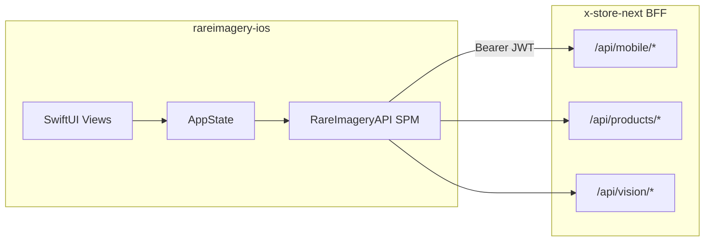
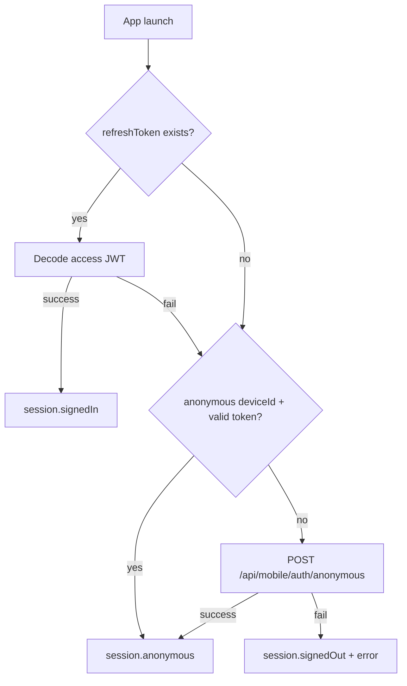
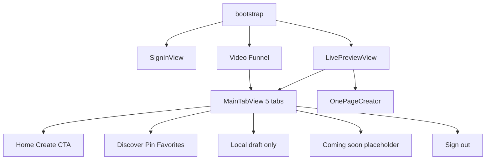

# RareImagery iOS — Code Review

**Review date:** 2026-07-05  
**Repository:** `rareimagery-ios`  
**Reviewer scope:** Static codebase review (no live BFF/Drupal verification)  
**Codebase state:** `useMocks = false` in [`AppState.swift`](../RareImagery/State/AppState.swift); live BFF integration assumed deployed locally.

---

## Executive Summary

### Verdict

The RareImagery iOS app is a **mature thin client** that has outgrown its README's "Phase A in progress" description. It ships multiple creator flows — anonymous video valuation funnel, X OAuth sign-in, post-sign-in onboarding, OnePageCreator merch generation with publish, photo capture/analysis, and Circle social features — over a well-factored local Swift Package (`RareImageryAPI`).

The app is **not TestFlight-ready** without auth session hardening and completion of several partially wired surfaces (QuickProduct create, slug pre-check, server-backed creations list). The core happy path (anonymous trial → X sign-in → OnePageCreator publish) is implemented and connected to live APIs.

### Readiness Snapshot

| Area | Status | Notes |
|------|--------|-------|
| X OAuth sign-in | **Implemented** | PKCE via `ASWebAuthenticationSession`; tokens in Keychain |
| Anonymous trial funnel | **Implemented** | Video → valuation → draft claim via OAuth |
| Post-sign-in onboarding | **Implemented** | `LivePreviewView` → `TweakSheetView` → `OnePageCreator` |
| OnePageCreator (primary create) | **Implemented** | merch-ideas → design generate → publish wired (Phase 4.4) |
| Photo capture pipeline | **Partial** | Built but orphaned from main navigation |
| Circle social | **Implemented** | Phase 1 complete per [PHASE_1_COMPLETE.md](PHASE_1_COMPLETE.md) |
| QuickProduct sell form | **Stub** | UI complete; `ProductRepository.create` not wired |
| Creations tab | **Partial** | Shows local `CaptureSession` draft only; no server list |
| Page editor tab | **Stub** | "Coming soon" placeholder |
| Auth session hardening | **Partial** | Refresh on 401 exists; proactive refresh and global sign-out missing |
| Push notifications | **Missing** | BFF web-push only; no APNs path |
| Apple Sign-In | **Missing** | BFF stub returns 501; no client UI |

### Top 5 Risks

1. **Expired-access bootstrap gap** — On launch, if the access JWT is expired but a refresh token exists, `tryProductionSession()` may fail decode and fall through to anonymous re-bootstrap instead of refreshing first.
2. **No global session drop on unrecoverable 401** — `APIClient` throws `unauthorized` after a failed refresh but never signs the user out; stale sessions can persist in a broken state.
3. **Orphaned legacy flows** — `FirstProductFlowView`, `WelcomeView`, `CaptureResultView`, and the photo capture pipeline are built but unreachable from the live router, increasing maintenance cost.
4. **Thin test coverage** — 29 unit tests across PKCE, JWT decode, error parsing, and funnel valuation mapping; no integration, ViewModel, or UI tests.
5. **README and contract drift** — README still describes Phase A; `CLAUDE.md` publish-path guidance conflicts with intentional `PublishProductRepository` usage for OnePageCreator.

### Recommended Next Sprint

1. **Auth hardening** — Proactive refresh 60s before expiry, bootstrap refresh when access is expired, global sign-out on unrecoverable 401, reconcile deep-link OAuth with draft-claim params.
2. **Wire remaining create surfaces** — `QuickProductView` product create, `TweakSheetView` slug pre-check via BFF.
3. **Server-backed Creations tab** — Replace local-only draft display with a product list from the BFF.
4. **Prune or route legacy screens** — Delete unreachable flows or wire them into navigation intentionally.
5. **Expand tests and sync docs** — APIClient refresh/retry tests, ViewModel state-machine tests, update README phase status.

---

## 1. System Overview

### Architecture



### Project Layout

| Path | Role |
|------|------|
| [`RareImagery/`](../RareImagery/) | App target — SwiftUI views, coordinators, local state |
| [`Packages/RareImageryAPI/`](../Packages/RareImageryAPI/) | Local SPM — networking, auth, models, repositories |
| [`RareImageryTests/`](../RareImageryTests/) | App-target unit tests |
| [`Configuration/`](../Configuration/) | xcconfig for API base URL and X client ID |
| [`project.yml`](../project.yml) | XcodeGen source of truth |

**106 Swift source files** across app + SPM. Zero third-party dependencies. iOS 17+, Swift 5.9, `@Observable` throughout.

### Entry Points

- **App launch:** [`RareImageryApp.swift`](../RareImagery/RareImageryApp.swift) — creates `AppState`, runs `bootstrap()`, handles `rareimagery://auth/callback` deep links.
- **Root router:** [`ContentView.swift`](../RareImagery/ContentView.swift) — routes by `AuthSession.status` (checking / signedOut / signedIn / anonymous).
- **Composition root:** [`AppState.swift`](../RareImagery/State/AppState.swift) — wires 9 repositories, `AuthService`, `APIClient`, `KeychainStore`, and `CaptureSession`.

### Session Tiers

The app supports three distinct session states:

| Tier | Trigger | Destination |
|------|---------|-------------|
| `signedOut` | No tokens, bootstrap failure | `SignInView` |
| `anonymous` | Fresh device or expired production session | Video funnel (first launch) → `MainTabView` |
| `signedIn` | Refresh token + valid access JWT | `LivePreviewView` (first time) → `MainTabView` |

---

## 2. Architecture Assessment

### Strengths

**Clean package separation.** All networking, auth, and API models live in the testable `RareImageryAPI` SPM package. The app target is mostly SwiftUI views and thin coordinators. This matches the thin-client contract in [`CLAUDE.md`](../CLAUDE.md).

**Modern Swift patterns.** The codebase uses `@Observable` for UI state, `actor` types for thread-safe networking and Keychain access, and `async/await` exclusively — no TCA, Redux, Combine, or third-party reactive libraries.

**Traceable dependency injection.** `AppState.init()` manually constructs all services and repositories. Views access them via `@Environment(AppState.self)`. No DI framework; easy to follow.

**Inline BFF contract documentation.** Repositories carry comments referencing BFF routes, error codes, phase history, and encoding quirks. This reduces the need to cross-reference the BFF repo for every endpoint.

**Offline demo mode.** `AppState.useMocks` toggles mock valuations in the funnel and capture flows without view changes — useful for UI demos when the BFF is unavailable.

### Concerns

**Parallel legacy flows.** Several fully built screens are unreachable from the live router:

- [`FirstProductFlowView`](../RareImagery/Onboarding/FirstProduct/FirstProductFlowView.swift) — superseded by OnePageCreator
- [`WelcomeView`](../RareImagery/Onboarding/WelcomeView.swift) — richer sign-in UX, not wired
- [`PermissionsView`](../RareImagery/Onboarding/PermissionsView.swift) — camera permission education, not wired
- [`CaptureResultView`](../RareImagery/Capture/CaptureResultView.swift) — built but `CaptureFlowView` uses inline preview instead

**DI inconsistency.** `CircleService` is lazy-instantiated inside the Circle tab rather than owned by `AppState`, unlike every other service.

**Mixed JSON encoding.** Some repositories use `APIEndpoint.json()` (snake_case), others manually encode with `.useDefaultKeys` to match specific BFF Zod schemas. Documented per route but error-prone when adding new endpoints.

**Swift 6 concurrency risk.** `Analytics` uses `nonisolated(unsafe)` statics for the client and session ID. Works today but may need attention under strict concurrency checking.

---

## 3. Auth and Session Review

### Flow Summary

| Step | File | Behavior |
|------|------|----------|
| Bootstrap | [`AppState.bootstrap()`](../RareImagery/State/AppState.swift) | Production (refresh token present) → signedIn; else anonymous mint |
| X OAuth PKCE | [`AuthService`](../Packages/RareImageryAPI/Sources/RareImageryAPI/Auth/AuthService.swift), [`AuthCoordinator`](../RareImagery/Auth/AuthCoordinator.swift) | Build authorize URL → `ASWebAuthenticationSession` → exchange code |
| Token storage | [`KeychainStore`](../Packages/RareImageryAPI/Sources/RareImageryAPI/Auth/KeychainStore.swift), [`APIClient.persist()`](../Packages/RareImageryAPI/Sources/RareImageryAPI/Client/APIClient.swift) | Access + refresh tokens in Keychain |
| JWT decode | [`JWTDecoder`](../Packages/RareImageryAPI/Sources/RareImageryAPI/Auth/JWTDecoder.swift) | Decode-only (no signature verification); validates `aud` and `exp` |
| Deep link | [`RareImageryApp.onOpenURL`](../RareImagery/RareImageryApp.swift) | Parallel callback path for `rareimagery://auth/callback` |
| Sign-out | [`AppState.signOut()`](../RareImagery/State/AppState.swift) | Clears tokens, anonymous state, resets capture |

### Bootstrap Resolution Order



### Findings (High Priority)

**1. No proactive token refresh**

`MobileClaims.shouldRefresh(within: 60)` exists and is documented per CLAUDE.md section 2.3, but is never called anywhere in the codebase:

```48:52:Packages/RareImageryAPI/Sources/RareImageryAPI/Models/MobileClaims.swift
    /// True when the token expires within the given window — caller should refresh.
    /// Spec (CLAUDE.md §2.3): refresh 60 s before expiry.
    public func shouldRefresh(within window: TimeInterval = 60) -> Bool {
        expiresAt.timeIntervalSinceNow <= window
    }
```

**2. Bootstrap skips refresh on expired access**

`tryProductionSession()` checks for a refresh token and decodes the access JWT. If the access token is expired, `JWTDecoder.decode()` throws and the method falls through to anonymous bootstrap — it never attempts `APIClient.refreshTokens()` first:

```98:109:RareImagery/State/AppState.swift
    private func tryProductionSession() async -> Bool {
        do {
            if let refresh = try await keychain.get(.refreshToken), !refresh.isEmpty,
               let access = try await keychain.get(.accessToken) {
                let claims = try JWTDecoder.decode(access)
                session.status = .signedIn(claims)
                return true
            }
        } catch {
            // fall through — production session unavailable, try anonymous
        }
        return false
    }
```

**3. 401 does not sign out globally**

`APIClient.send()` attempts one refresh on 401, then retries once. If refresh fails, it throws `APIError.unauthorized` but never notifies `AuthSession` to drop the session:

```35:42:Packages/RareImageryAPI/Sources/RareImageryAPI/Client/APIClient.swift
        if http.statusCode == 401 && endpoint.requiresAuth && retryOn401 {
            logger.info("401 received — attempting token refresh and single retry")
            do {
                _ = try await refreshTokens()
            } catch {
                throw APIError.unauthorized
            }
            return try await send(endpoint, as: Response.self, retryOn401: false)
        }
```

**4. Duplicate OAuth callback paths**

`AuthCoordinator.signInWithX()` passes `draftToken`, `draftUuid`, and `deviceId` for funnel draft-claim handoff. The deep-link handler in `RareImageryApp` calls `completeXAuth(callbackURL:)` without those params — draft claims from the funnel would be lost if OAuth completes via deep link instead of `ASWebAuthenticationSession`.

**5. Apple Sign-In not implemented**

The BFF stub at `/api/mobile/auth/apple/callback` returns 501. The client has an error message mapping (`APPLE_AUTH_NOT_READY`) but no sign-in button or flow.

### What Works Well

- PKCE S256 implementation with state validation and verifier cleanup in `defer`
- Refresh coalescing via `refreshTask` in `APIClient` — concurrent callers share one in-flight refresh
- Production vs anonymous discrimination via refresh token presence (clean signal, no JWT decode needed)
- Draft claim handoff through OAuth callback when initiated from `FunnelResultView`
- `APIError.userFacingMessage` implements mandated copy for `SLUG_TAKEN` and `RESERVED_SLUG`

---

## 4. API Layer Review

### Core Stack

| Component | Path | Role |
|-----------|------|------|
| `APIConfiguration` | `Packages/.../Client/APIConfiguration.swift` | Reads `APIBaseURL`, `XClientID` from Info.plist |
| `APIClient` | `Packages/.../Client/APIClient.swift` | Actor; URLSession; JSON decode; 401 → refresh → single retry |
| `APIEndpoint` | `Packages/.../Client/APIEndpoint.swift` | Path/method/body builder |
| `APIError` | `Packages/.../Client/APIError.swift` | Rich error mapping with user-facing messages |
| `MultipartEncoder` | `Packages/.../Client/MultipartEncoder.swift` | Built but unused by any repository |

### Repository Inventory

| Repository | Key Endpoints |
|------------|---------------|
| `AuthRepository` | `POST /api/mobile/auth/x/callback` |
| `AnonymousAuthRepository` | `POST /api/mobile/auth/anonymous` |
| `ProductRepository` | `POST /api/vision/analyze`, `POST /api/v1/vision/value`, `POST /api/vision/merch-ideas`, product CRUD + publish |
| `DesignGenerationRepository` | `POST /api/design-studio/generate`, poll task status |
| `PublishProductRepository` | `POST /api/v1/design-studio/publish` |
| `OnboardingRepository` | `POST /api/v1/creator/provision-store`, store update |
| `CircleRepository` | `GET /api/social/circle/suggestions`, `GET/PUT /api/social/circle`, `GET /api/x/search-users` |
| `CircleShareRepository` | `POST /api/v1/circle/share` |
| `VideoUploadRepository` | `POST /api/mobile/upload-video` (commented as not live) |

Token refresh is handled inside `APIClient` at `POST /api/mobile/auth/refresh`, not a separate `TokenRefresher` type (README is stale on this point).

### Vision Transport

Vision endpoints use **JSON with base64 data URLs**, not multipart `/api/products/from-images`. This is explicitly documented in `ProductRepository.swift`. The `MultipartEncoder` exists but no repository calls it.

### Contract Drift

| Issue | Detail |
|-------|--------|
| README references `TokenRefresher` | Logic lives in `APIClient.refreshTokens()` |
| CLAUDE.md publish-path guidance | Says mobile must not call design-studio publish; `PublishProductRepository` intentionally calls `/api/v1/design-studio/publish` for OnePageCreator Phase 4.4 — document the intentional exception |
| `MultipartEncoder` unused | Vision uses JSON base64; multipart path from CLAUDE.md section 5 not adopted on iOS |
| Slug check endpoint | `TweakSheetView` comments reference `/api/v1/stores/check-slug` with mobile Bearer auth working, but the client call is stubbed |

---

## 5. Feature and UX Review

### User Flow Map



### Feature Status

| Flow | Status | Key Files |
|------|--------|-----------|
| X OAuth sign-in | Implemented | `SignInView`, `AuthCoordinator` |
| Anonymous video funnel | Implemented (live API) | `Funnel/*` |
| Post-sign-in onboarding | Implemented | `LivePreviewView`, `TweakSheetView` |
| OnePageCreator (primary create) | Implemented + publish wired | `OnePageCreator/*` |
| Photo capture pipeline | Built, orphaned from nav | `Capture/*` — only reachable via legacy wizard |
| QuickProduct sell form | UI only, create not wired | `QuickProductView` |
| Circle social | Phase 1 complete | `Circle/*` |
| Page editor tab | Placeholder | `MainTabView` PageTabView |
| Creations tab | Local `CaptureSession` draft only | No server-backed list |
| Send to Circle | Implemented | `SendToCircleSheet` |
| Store tweak (color/bio/slug) | Partial — slug check stubbed | `TweakSheetView` |

### OnePageCreator (Primary Creation Path)

The current primary merch creation flow:

1. Hero from X profile picture (`UserAsProductHero`) or optional burst-capture URLs
2. Auto-fetch Grok merch ideas via `/api/vision/merch-ideas`
3. User picks product kind chips, selects an idea, previews design generation
4. "Create my shirt + launch store" calls `PublishProductRepository` (Phase 4.4 wired)
5. Optional "Send to Circle" toggle opens `SendToCircleSheet`
6. Anonymous users get 3 free idea calls, then `SignUpReminderBanner` + `SignInView` sheet

Entry points: `LivePreviewView` primary CTA and `HomeTabView` Create button.

### Anonymous Video Funnel

Value-first flow for users without an account:

1. Instructions → record video (AVFoundation)
2. On-device frame extraction + speech transcription
3. `POST /api/v1/vision/value` for valuation
4. Result screen with estimated value
5. "Claim this draft" triggers X OAuth with pending draft token/UUID

"Skip for now" sets `hasSeenFunnel = true` and lands in `MainTabView`.

### Incomplete and Stub Screens

| Item | Location | Status |
|------|----------|--------|
| Page editor | `MainTabView` PageTabView | "Full page editor coming soon" placeholder |
| QuickProduct create | `QuickProductView` | Button logs/dismisses; endpoint not wired |
| CaptureResultView | `Capture/CaptureResultView.swift` | Built; not referenced (CaptureFlowView uses inline preview) |
| FirstProductFlowView | `Onboarding/FirstProduct/` | Superseded by OnePageCreator; unreachable |
| WelcomeView / PermissionsView | `Onboarding/` | Built; not in ContentView router |
| Printful templates | `FirstProductCaptureView` | "Coming soon" copy |
| TweakSheet slug check | `TweakSheetView` | `checkSlugRemote` always returns true |
| Funnel signed-in sell CTA | `FunnelResultView` | Empty branch when already signed in (Phase 5 stub) |
| Apple Sign-In | — | No UI button |
| Bio from server | `LivePreviewView` | Empty placeholder; no `/api/me` fetch |

### UX Observations

**Design token drift.** Onboarding screens use local orange `onboardingCTA` (`#FF6B00`) while the refreshed global `AppColor.cta` is gold (`#D4AF37`). Funnel and OnePageCreator consistently use the gold palette.

**Error handling inconsistency.** Three or more visual patterns coexist: red caption text (auth, QuickProduct), orange caption text (OnePageCreator), `ErrorBanner` with retry (Circle), and inline overlays (capture). No global error toast or modifier.

**Accessibility gaps.** Approximately 13 files contain explicit `accessibilityLabel` annotations (~15 call sites). Missing broadly: Dynamic Type / `@ScaledMetric`, Reduce Motion support for funnel animations, tab bar labels, filmstrip thumbnails, and most form fields.

**Intentional mixed theme.** `SendToCircleSheet` uses light system colors inside the dark-mode app — appears deliberate for the share sheet context.

**Typography fallback.** Custom font families (Space Grotesk, Hanken Grotesk, JetBrains Mono) are referenced in `Typography.swift` but may fall back to system fonts if TTFs are not bundled.

---

## 6. Testing and Quality

### Current Coverage

**29 unit tests** across two targets:

| Suite | Path | Tests | Coverage |
|-------|------|-------|----------|
| `PKCETests` | `Packages/.../Tests/PKCETests.swift` | 4 | PKCE verifier/challenge generation |
| `JWTDecoderTests` | `Packages/.../Tests/JWTDecoderTests.swift` | 4 | JWT decode, audience, expiry |
| `MobileErrorResponseTests` | `Packages/.../Tests/MobileErrorResponseTests.swift` | 4 | Error envelope parsing |
| `FunnelValuationTests` | `RareImageryTests/FunnelValuationTests.swift` | 17 | Price band and insights mapping |

Run SPM tests:

```bash
swift test --package-path Packages/RareImageryAPI
```

### Gaps

- No `APIClient` integration tests (401 retry, refresh coalescing, token persistence)
- No `AuthService` or OAuth flow tests
- No ViewModel tests (`OnePageCreatorViewModel`, `CaptureCoordinator`, `FunnelViewModel`)
- No UI or snapshot tests (README Phase D mentions these — not started)
- App-target and SPM tests run via separate schemes; no unified CI test target

---

## 7. Configuration and Build

### xcconfig

| File | Purpose |
|------|---------|
| [`Configuration/Debug.xcconfig`](../Configuration/Debug.xcconfig) | `API_BASE_URL = http://localhost:3000`, `X_CLIENT_ID` placeholder |
| [`Configuration/Release.xcconfig`](../Configuration/Release.xcconfig) | Production URL + client ID |
| `Configuration/Debug.local.xcconfig` | Gitignored secrets (example template provided) |

### App Identity

| Property | Value |
|----------|-------|
| Bundle ID | `com.rareimagery.studio` |
| URL scheme | `rareimagery` (OAuth callback: `rareimagery://auth/callback`) |
| Version | 0.1.0 (build 1000) |
| Team ID | `7ZGZLG2SRQ` |
| ASC App ID | `6771493728` |
| Universal Links | `applinks:rareimagery.net`, `applinks:*.rareimagery.net` |

### Build Tooling

- **XcodeGen** via [`project.yml`](../project.yml) — rerun `xcodegen generate` when adding/removing Swift files
- Two schemes: `RareImagery` and `RareImageryStudio` (Xcode Cloud alias)
- Privacy strings configured for camera, microphone, speech recognition, and photo library

### Documentation Drift

[`README.md`](../README.md) phases section still says "Phase A — Auth + skeleton (in progress)" and references `TokenRefresher`. The codebase has implemented Phases B–D features (capture, draft review, OnePageCreator publish, Circle, funnel). README should be updated to reflect current state.

---

## 8. Prioritized Recommendations

### P0 — Ship Blockers

| Item | Action | Files |
|------|--------|-------|
| Proactive token refresh | Call `shouldRefresh(within: 60)` before authenticated requests; refresh if true | `APIClient`, `AppState` |
| Bootstrap refresh | On expired access + valid refresh, call `refreshTokens()` before falling through to anonymous | `AppState.tryProductionSession()` |
| Global session drop | On unrecoverable 401 after refresh failure, call `session.setSignedOut()` | `APIClient` + callback to `AppState` |
| Deep-link OAuth parity | Pass `draftToken`/`draftUuid`/`deviceId` in `RareImageryApp.onOpenURL` handler | `RareImageryApp.swift` |

### P1 — Feature Completion

| Item | Action | Files |
|------|--------|-------|
| QuickProduct create | Wire `ProductRepository.create(...)` in sell button handler | `QuickProductView.swift` |
| Slug pre-check | Implement `checkSlugRemote` against BFF (mobile Bearer auth confirmed working) | `TweakSheetView.swift` |
| Funnel signed-in adoption | Implement Phase 5 "adopt valuation" branch for signed-in users | `FunnelResultView.swift` |
| Server-backed creations | Add product list endpoint consumption for Creations tab | `MainTabView.swift`, new repository method |
| Capture pipeline routing | Either wire capture into Home/Creations tab or remove orphaned code | `Capture/*`, `MainTabView.swift` |

### P2 — Quality and Maintenance

| Item | Action |
|------|--------|
| Legacy screen cleanup | Delete or route `FirstProductFlowView`, `WelcomeView`, `PermissionsView`, `CaptureResultView` |
| Error UX unification | Adopt `ErrorBanner` or a shared error modifier app-wide |
| Design token alignment | Replace onboarding orange `onboardingCTA` with `AppColor.cta` gold |
| Test expansion | APIClient refresh/retry, AuthService, ViewModel state machines, snapshot tests |
| README sync | Update phase status, remove `TokenRefresher` reference, document current flows |
| Accessibility pass | Dynamic Type, Reduce Motion, systematic labels on interactive elements |
| Swift 6 readiness | Review `Analytics` `nonisolated(unsafe)` usage |

---

## 9. Appendix

### Module Map

```
RareImagery/                          Packages/RareImageryAPI/
├── Auth/          Sign-in, OAuth       ├── Auth/         PKCE, Keychain, JWT, AuthService
├── Capture/       Photo + analyze      ├── Client/       APIClient, APIError, endpoints
├── Circle/        Social features      ├── Models/       18 model files
├── Components/    Shared UI            ├── Repositories/ 9 repository actors
├── Funnel/        Video valuation      └── Analytics/    Telemetry dispatch
├── Onboarding/    Welcome + tweak
├── OnePageCreator/  Primary create
├── Product/       Quick sell form
├── State/         AppState, sessions
├── Tabs/          5-tab shell
└── Theme/         Colors, Typography
```

### Related Documentation

| Document | Purpose |
|----------|---------|
| [`CLAUDE.md`](../CLAUDE.md) | BFF contract briefing (authoritative for server API) |
| [`README.md`](../README.md) | Build instructions (partially stale) |
| [`docs/PHASE_1_COMPLETE.md`](PHASE_1_COMPLETE.md) | Circle Phase 1 completion record |
| [`docs/CIRCLE_SHARE_HANDOFF.md`](CIRCLE_SHARE_HANDOFF.md) | Circle share feature handoff |
| [`VALUE-FIRST-OAUTH.md`](../VALUE-FIRST-OAUTH.md) | Anonymous trial + draft claim spec |
| [`XTOOLS-APPFLOW.md`](../XTOOLS-APPFLOW.md) | App flow reference |
| [`Plans/Phase-3-Video-Voice-Capture-Plan.md`](../Plans/Phase-3-Video-Voice-Capture-Plan.md) | Video capture phase plan |

### Anti-Patterns Compliance (from CLAUDE.md)

| Rule | Status |
|------|--------|
| No direct X API calls from Swift | Compliant — OAuth via BFF callback |
| No Drupal writes from client | Compliant — all writes through BFF |
| No JWT signing on device | Compliant — decode-only |
| No client-side LLM calls | Compliant — vision via BFF |
| Refresh tokens only in Keychain | Compliant |
| No `x_user_profile` bundle targeting | N/A (client-side) |
| No hardcoded `rareimagery.net` URLs | Compliant — uses `APIConfiguration.baseURL` |
| No Combine | Compliant — async/await only |
| No third-party reactive libs | Compliant — `@Observable` only |
| No design-studio publish from mobile | **Exception** — `PublishProductRepository` calls `/api/v1/design-studio/publish` intentionally for OnePageCreator Phase 4.4; CLAUDE.md should be updated to document this mobile path |

---

*End of review. For questions about BFF contracts, see [`CLAUDE.md`](../CLAUDE.md). For build instructions, see [`README.md`](../README.md).*
